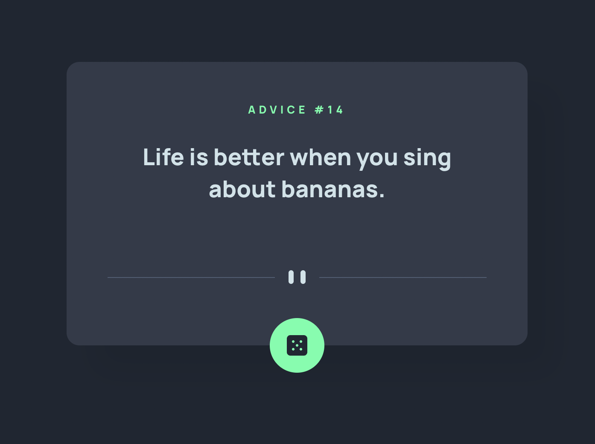
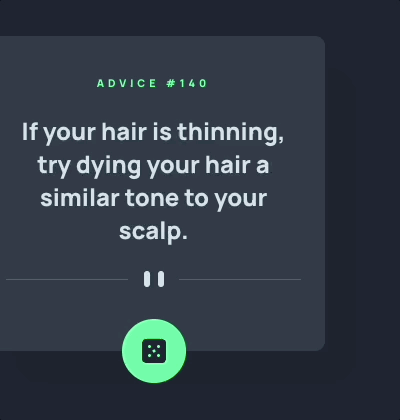

# Frontend Mentor - Advice generator app solution

This is a solution to the [Advice generator app challenge on Frontend Mentor](https://www.frontendmentor.io/challenges/advice-generator-app-QdUG-13db). Frontend Mentor challenges help you improve your coding skills by building realistic projects.

## Table of contents

- [Overview](#overview)
  - [The challenge](#the-challenge)
  - [Screenshot](#screenshot)
  - [Links](#links)
- [My process](#my-process)
  - [Built with](#built-with)
  - [What I learned](#what-i-learned)
  - [Useful resources](#useful-resources)

## Overview

### The challenge

Users should be able to:

- View the optimal layout for the app depending on their device's screen size
- See hover states for all interactive elements on the page
- Generate a new piece of advice by clicking the dice icon

### Screenshots

### Links

- Solution URL: [Github](https://github.com/dj-drakos/fem-advice-generator-app)
- Live Site URL: [Netlify](https://advice-dice.netlify.app/)

## My process

### Built with
Semantic HTML5 markup | Flexbox | CSS Grid | Mobile-first workflow | [React](https://reactjs.org/) | Fetch API

### What I learned

This was a great compact exercise in building a responsive UI that delivers a smooth experience through state changes. Some design decisions that came up in this process were:
- Layout decisions: 
    - Make it responsive
    - Make it dynamic in case incoming advice slips are quite long
    - Make sure it doesn't break during loading states
- Inline SVG practice: 
  -  Using CSS to render svgs responsively
  - Markup for screen reader accessibility
- Button considerations
  - Make it intuitive
  - Limit clicking between renders, or before the server will generate a new advice slip

### Useful resources

- [Carnegie Museums Web Accessibility Guidelines](http://web-accessibility.carnegiemuseums.org/code/svg/) - SVG icon font guidelines for accessible markup
